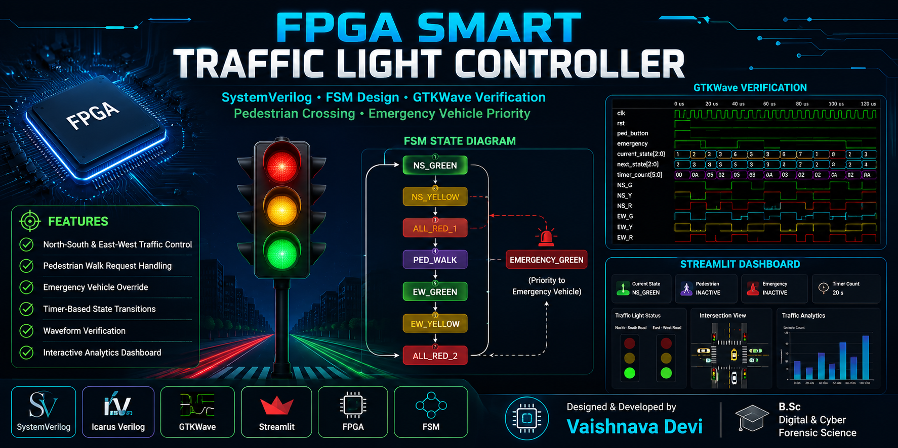
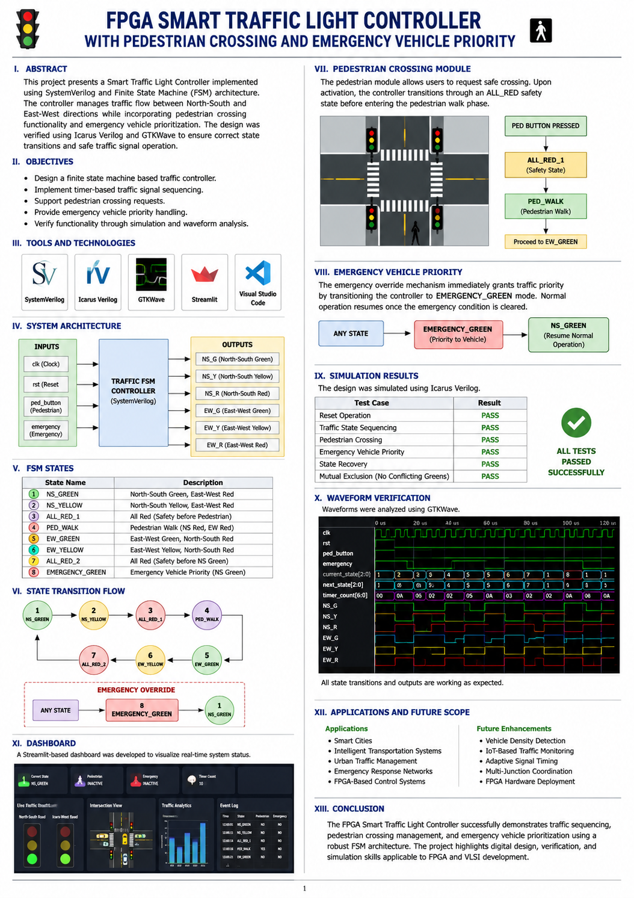
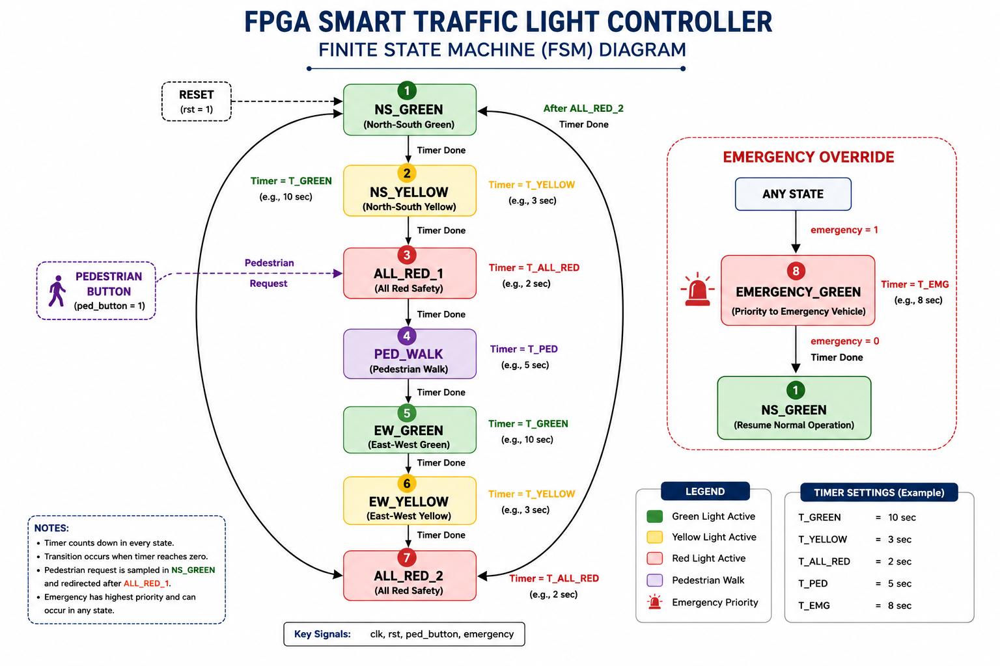
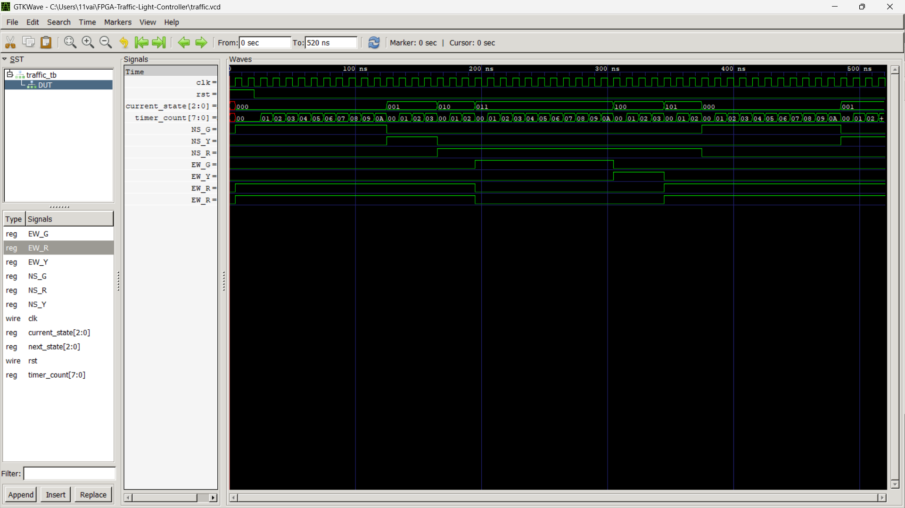
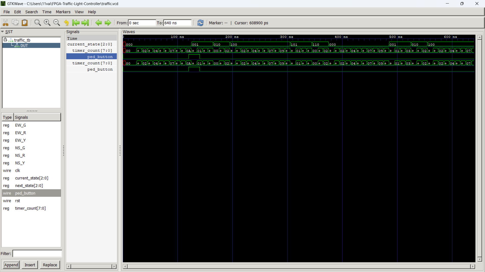
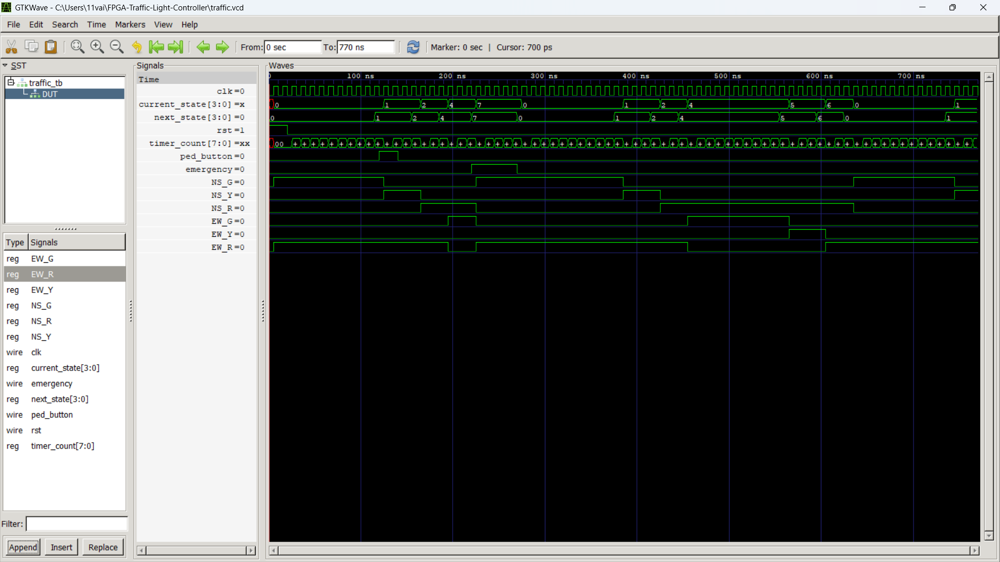
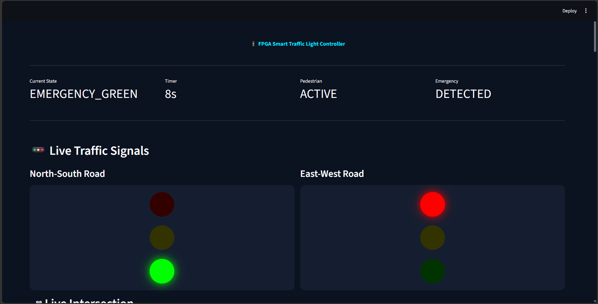

<p align="center">
  
</p>

<h1 align="center">🚦 FPGA Smart Traffic Light Controller</h1>

<p align="center">
  <b>SystemVerilog FSM-Based Intelligent Traffic Management System</b>
</p>

<p align="center">
  Pedestrian Crossing • Emergency Vehicle Priority • GTKWave Verification • Streamlit Dashboard
</p>

---

## 📌 Overview

The FPGA Smart Traffic Light Controller is a SystemVerilog-based Finite State Machine (FSM) project designed to manage traffic flow efficiently and safely at a road intersection.

This controller incorporates:

✅ North-South and East-West Traffic Control

✅ Pedestrian Crossing Support

✅ Emergency Vehicle Priority Override

✅ Safe All-Red Transition States

✅ GTKWave Verification

✅ Interactive Streamlit Dashboard

The project demonstrates practical concepts in:

- FPGA Design
- RTL Development
- FSM Modeling
- Digital Logic Design
- Verification Engineering
- Traffic Management Systems

---

## 🎯 Key Features

### 🚦 Traffic Signal Control

- North-South Traffic Sequencing
- East-West Traffic Sequencing
- Timer-Based State Transitions
- Safe Traffic Coordination

### 🚶 Pedestrian Crossing Support

- Pedestrian Request Button
- Dedicated Pedestrian Walk State
- Safe All-Red Transition
- Automatic Return to Traffic Flow

### 🚑 Emergency Vehicle Priority

- Emergency Detection Input
- Immediate Priority Access
- Traffic Override Functionality
- Safe Recovery Mechanism

### 📊 Monitoring & Analytics

- Real-Time Dashboard
- Traffic State Visualization
- Traffic Analytics
- Event Monitoring
- Verification Reports

---

## 🏗️ System Architecture

<p align="center">
  
</p>

### Inputs

| Signal | Description |
|----------|-------------|
| clk | System Clock |
| rst | System Reset |
| ped_button | Pedestrian Crossing Request |
| emergency | Emergency Vehicle Detection |

### Outputs

| Signal | Description |
|----------|-------------|
| NS_G | North-South Green |
| NS_Y | North-South Yellow |
| NS_R | North-South Red |
| EW_G | East-West Green |
| EW_Y | East-West Yellow |
| EW_R | East-West Red |

---

## 🔄 FSM State Diagram

<p align="center">
  
</p>

### FSM States

| State | Description |
|---------|-------------|
| NS_GREEN | North-South Green |
| NS_YELLOW | North-South Yellow |
| ALL_RED_1 | Safety Transition State |
| PED_WALK | Pedestrian Walk State |
| EW_GREEN | East-West Green |
| EW_YELLOW | East-West Yellow |
| ALL_RED_2 | Safety Transition State |
| EMERGENCY_GREEN | Emergency Priority State |

---

## ⚙️ State Transition Flow

```text
NS_GREEN
    ↓
NS_YELLOW
    ↓
ALL_RED_1
    ↓
PED_WALK
    ↓
EW_GREEN
    ↓
EW_YELLOW
    ↓
ALL_RED_2
    ↓
NS_GREEN
```

### Emergency Override

```text
ANY_STATE
    ↓
EMERGENCY_GREEN
    ↓
NS_GREEN
```

---

## 📂 Project Structure

```text
FPGA-Smart-Traffic-Light-Controller
│
├── rtl/
│   └── traffic_fsm.sv
│
├── tb/
│   └── traffic_tb.sv
│
├── constraints/
│   └── traffic_constraints.xdc
│
├── scripts/
│   ├── compile.bat
│   ├── simulate.bat
│   ├── open_waveform.bat
│   └── run_all.bat
│
├── dashboard/
│   ├── app.py
│   ├── traffic_data.csv
│   └── requirements.txt
│
├── waveforms/
│   ├── traffic.vcd
│   └── waveform_analysis.md
│
├── reports/
│   └── simulation_report.md
│
├── docs/
│   └── project_report.pdf
│
├── images/
│   ├── github_banner.png
│   ├── architecture.png
│   ├── fsm_diagram.png
│   ├── dashboard.png
│   ├── traffic_waveform.png
│   ├── pedestrian_waveform.png
│   └── final_waveform.png
│
├── README.md
├── LICENSE
├── requirements.txt
└── .gitignore
```

---

## 🧪 Simulation

### Compile Design

```bash
iverilog -g2012 -o traffic.out rtl/traffic_fsm.sv tb/traffic_tb.sv
```

### Run Simulation

```bash
vvp traffic.out
```

### Open Waveform

```bash
gtkwave traffic.vcd
```

---

## 🚦 Traffic Signal Verification

<p align="center">
  
</p>

### Verified States

- NS_GREEN
- NS_YELLOW
- EW_GREEN
- EW_YELLOW
- ALL_RED States

The waveform confirms proper timer-based sequencing and safe traffic signal transitions.

---

## 🚶 Pedestrian Crossing Verification

<p align="center">
  
</p>

### Pedestrian Features Verified

- Pedestrian Button Detection
- Safe Traffic Halt
- Dedicated PED_WALK State
- Automatic Traffic Recovery

The controller successfully processes pedestrian requests without compromising traffic safety.

---

## 📈 Complete FSM Verification

<p align="center">
  
</p>

### Verified Signals

- clk
- rst
- current_state
- next_state
- timer_count
- ped_button
- emergency
- NS_G
- NS_Y
- NS_R
- EW_G
- EW_Y
- EW_R

---

## ✅ Simulation Results

| Test Case | Result |
|------------|---------|
| Reset Functionality | ✅ PASS |
| NS Green Operation | ✅ PASS |
| NS Yellow Operation | ✅ PASS |
| Pedestrian Request | ✅ PASS |
| Pedestrian Walk State | ✅ PASS |
| EW Green Operation | ✅ PASS |
| EW Yellow Operation | ✅ PASS |
| Emergency Override | ✅ PASS |
| Emergency Recovery | ✅ PASS |
| FSM Recovery | ✅ PASS |

---

## 📊 Interactive Streamlit Dashboard

<p align="center">
  
</p>

### Dashboard Features

- Live Traffic Monitoring
- Signal Status Tracking
- Pedestrian Analytics
- Emergency Event Monitoring
- Traffic Statistics
- FSM State Tracking
- Traffic Visualization

---

## 🖼️ Project Gallery

### Architecture

<p align="center">
  
</p>

### FSM Diagram

<p align="center">
  
</p>

### Dashboard

<p align="center">
  
</p>

### Verification Waveform

<p align="center">
  
</p>

---

## 🚀 Applications

- Smart Cities
- Intelligent Transportation Systems
- Urban Traffic Management
- Emergency Response Networks
- FPGA-Based Controllers
- Embedded Systems
- VLSI Design Projects
- Academic Research

---

## 🔮 Future Enhancements

- Vehicle Density Detection
- Adaptive Signal Timing
- AI-Based Traffic Optimization
- IoT Traffic Monitoring
- Multi-Junction Synchronization
- Camera-Based Traffic Analysis
- FPGA Hardware Deployment
- Cloud-Based Traffic Analytics

---

## 🛠️ Technologies Used

### Hardware Design

- FPGA Design Methodology
- RTL Design
- FSM Modeling

### Languages

- SystemVerilog
- Python

### Verification Tools

- Icarus Verilog
- GTKWave

### Dashboard

- Streamlit
- Pandas
- Plotly

---

## 📄 Documentation

Detailed project documentation is available in:

```text
docs/project_report.pdf
```

Additional reports:

```text
reports/simulation_report.md
waveforms/waveform_analysis.md
```

---

## 👩‍💻 Author

### Vaishnava Devi

**B.Sc Digital & Cyber Forensic Science**

🔗 GitHub: https://github.com/VaishnavaDevi-R

🔗 LinkedIn: https://www.linkedin.com/in/vaishnava-devi-141142321/

🔗 Instagram: https://www.instagram.com/_vaishforge_/

---

## 🌟 Support

If you found this project useful:

⭐ Star this repository

🍴 Fork the repository

📢 Share with others

---

## 📜 License

This project is licensed under the MIT License.

See the LICENSE file for more information.